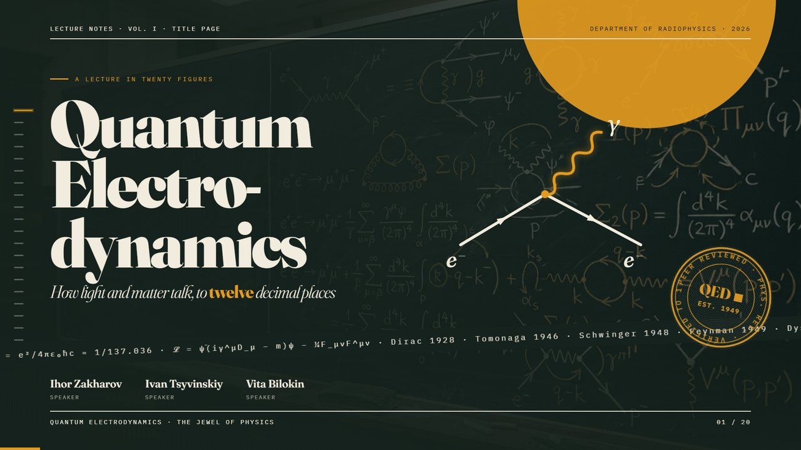
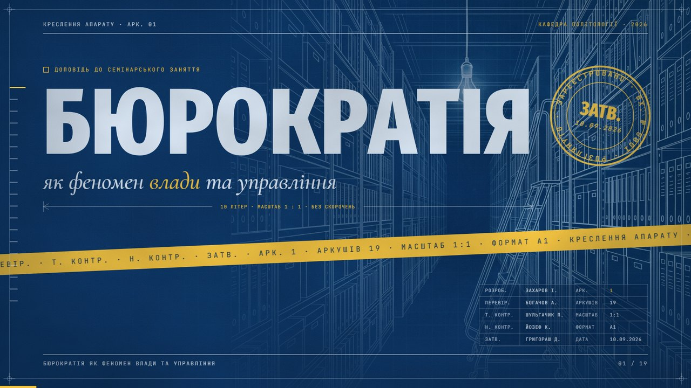
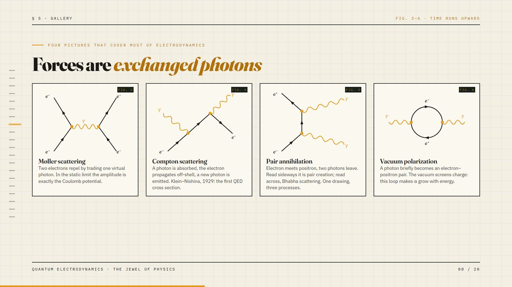
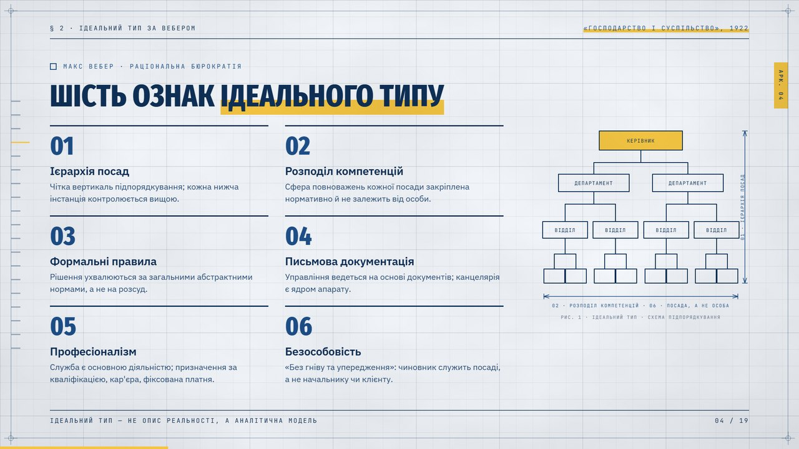
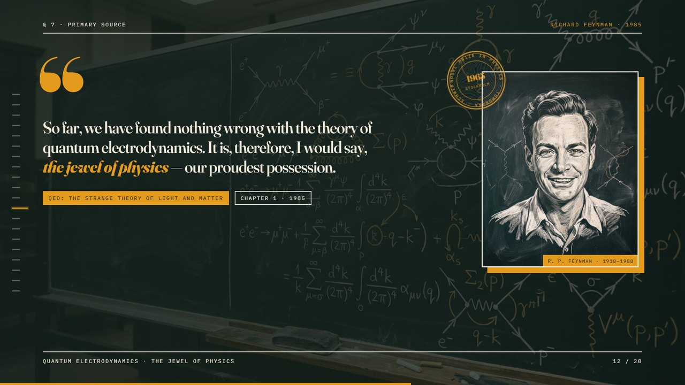
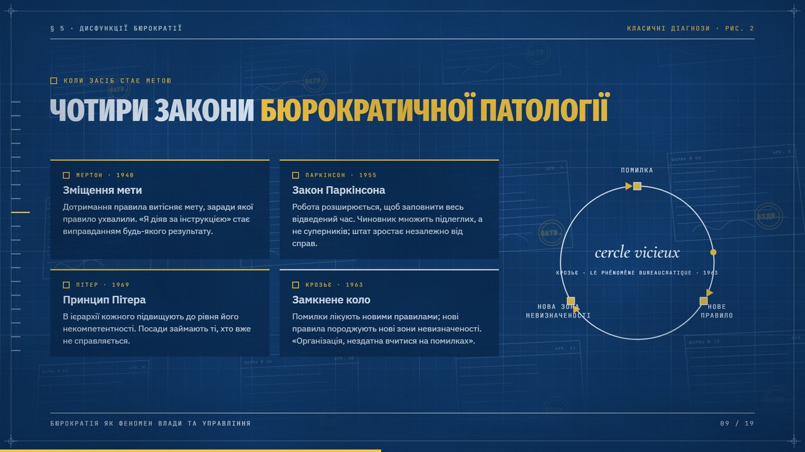
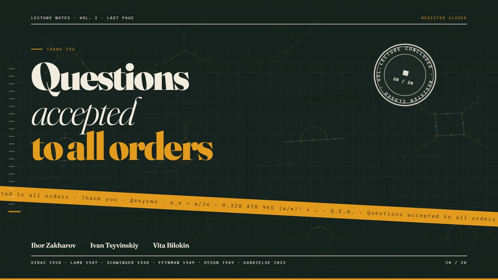
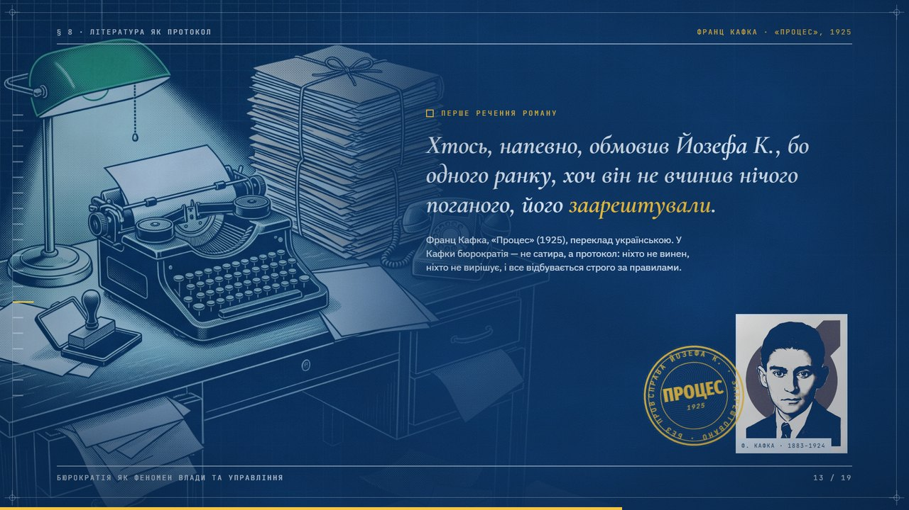

# deck-workflow — an end-to-end Claude Code skill for reference-quality HTML presentations

**RU.** Сквозной сервис генерации презентаций для Claude Code: пишете тему и короткое описание — получаете готовую, максимально красивую и уникальную HTML-деку (фиксированная сцена 1920×1080, анимации со вкусом, дизайн-система и A4-брендбук, 3–4 слота под изображения с готовыми промптами для Gemini, проверка каждого слайда скриншотами). Всё автономно: без анкет; Claude пишет вам дважды — сразу после плана с промптами для картинок (две из них — фоны), затем при сдаче. Каждая дека уникальна по дизайну; универсальные приёмы (ленты, штампы, текстовые билды, самочертящиеся схемы, 3D-стена как фон, «материальный» слой поверх слайдов) берутся из двух эталонных дек как идеи, а не как готовые куски.

**EN.** An end-to-end Claude Code skill: give it a topic and a short description, get a finished, maximally beautiful and fully unique HTML deck — fixed 1920×1080 stage, tasteful Apple-grade motion, a design-system page and an A4 brand book, 3–4 image slots with ready Gemini prompts (two of them full-bleed backgrounds), every slide screenshot-verified. Fully autonomous: no questionnaires; Claude messages you twice — right after the storyline with the image prompts, then at delivery. Every deck is unique in design; the universal devices (bands, stamps, text builds, self-drawing mechanisms, the 3D wall as a background, the material layer over the slides) are taken from the two reference decks as ideas, never copied.

## The two standards

| QED v3 «Lecture Notes» (English, physics) | Бюрократія v2 «Креслення апарату» (Ukrainian, political science) |
|---|---|
|  |  |
|  |  |
|  |  |
|  |  |

Both live in `templates/` as complete decks with their design systems and brand books (`example-qed-v3-*`, `example-blueprint-*`). `reference/deck-ledger.md` records every deck on 8 style axes; a new deck must differ from the last two in at least 5 of them.

## Install

```bash
git clone https://github.com/<you>/deck-workflow ~/.claude/skills/deck-workflow
cd ~/.claude/skills/deck-workflow
cp LOCAL.example.md LOCAL.md      # set your output folder, Chrome path, how to open files
bash scripts/verify.sh            # every line must say OK
```

Windows: clone into `C:\Users\<name>\.claude\skills\deck-workflow\`; from WSL2 use the Windows Chrome binary (see `LOCAL.example.md`). Claude Code picks the skill up on the next session as `/deck-workflow`. Optional companion skills (free): `frontend-slides` (zarazhangrui), `design-system`, `frontend-design`, `pptx` (anthropics/skills) — the workflow degrades gracefully without them.

Requirements: Claude Code; Google Chrome (headless screenshots and PDF); internet for Google Fonts, KaTeX and research; Python 3 with Pillow (image cropping, contact sheets, the springs generator). No Node, no build step.

## Use — the end-to-end flow

```
/deck-workflow Quantum electrodynamics — a lecture for radiophysicists, English, 20 slides, with a glossary; authors A, B, C
```

1. **Brief + research** — `brief.md` with the audience, language, length; 2–6 web searches for real facts, quotes with sources, the latest numbers.
2. **Storyline** — sections, one assertion per slide, the STAR moment, 2–4 signature animations, 3–4 image slots. **Message 1 to you**: 3–4 Gemini prompts in code blocks with exact save paths — two full-bleed backgrounds (the title always gets one; the second under the quote/STAR or the audience slide), one portrait/artefact, optionally a fourth. You generate while the build continues.
3. **Direction** — a look that differs from your previous decks (ledger axes), tokens, three faces, the device family, the motion easing family; a design-system page and an A4 brand-book PDF.
4. **Build** — fixed stage, crossfade-only transitions, side nav with hover labels, inline editor (`E`, `Ctrl+S`), letter/word builds, stamps and bands where the world has verdicts, self-drawing diagrams and mechanisms, the dim 3D wall as a background, a material layer over the slides, KaTeX, glossary tables, springs as CSS `linear()`.
5. **Images** — paste the Gemini renders into the chat (or drop them into `<deck>/assets/`): Claude identifies them, crops the generator's inset border, wires them and lays the slides out around them. Fallback ladder: any other generator → public-domain archives → a designed procedural background.
6. **Verify** — every slide rendered with headless Chrome and inspected (overlaps, one-line headings, contrast, glyphs, cascades incl. a mid-animation frame); three gates (anti-slop, perception, motion); the delivery checksum in `CHECKSUM.md`.
7. **Deliver** — **message 2**: paths (deck, design system, brand book PDF, brief), the style thesis, the slide list, signature moments, edit instructions, export offers (PDF via Chrome print, PPTX via the `pptx` skill, deploy).

Output per deck: `<root>/<slug>/deck.html`, `brief.md`, `design/design-system.html`, `design/brand-book-a4.html` + `.pdf`, `assets/`, `lib/springs.css`.

## Repository layout

- `SKILL.md` — the contract, house rules, the pipeline (Phases 0–9), quality gates; read by Claude at session start.
- `CHECKSUM.md` + `scripts/verify.sh` — install manifest and the session/delivery verification prompts.
- `reference/` — `taste.md` (judgement), `motion-system.md` + `springs.css` (Apple-grade motion, recipes 5.1–5.16), `perception.md` (design psychology), `deck-ledger.md` (uniqueness axes, every deck, unused direction seeds), `components.md` (house components incl. the blueprint additions), `images.md` + `image-prompts.md` (the image loop), `pitfalls.md` (everything that broke and the fix), `sources.md`, `luxury-type-motion.md`.
- `templates/` — five complete verified decks: the two standards (QED v3, Blueprint) with design systems and brand books, plus Апарат (constructivist), QED v1 and QED v2 «Keynote Noir».
- `library/` — vendored open-source corpora (MIT/Apache): huashu-design, next-slide (36 presets + 56 live style demos), html-ppt-skill (animations + canvas effects), visual-cognition-slides (pedagogy), skills-slides (tokens + anti-slop checklist), claude-slides, claude-design style gallery, Anthropic frontend-design/theme-factory, jquery-feyn; `library/vendor/` — GSAP, Motion, rough-notation, rough.js, vivus, Splitting. Start at `library/INDEX.md`.
- `scripts/render.sh` (cross-platform screenshots), `scripts/spring.py` (springs), `docs/screenshots/` (the images above).
- `LOCAL.example.md` → `LOCAL.md` (machine paths; git-ignored), `.gitignore`, `LICENSE`.

## Share or publish

- **GitHub**: the folder is a repository as is — `git init && git add -A && git commit -m "deck-workflow" && gh repo create deck-workflow --public --source . --push`. `.gitignore` keeps `LOCAL.md`, zips and screenshots out.
- **Zip**: `cd ~/.claude/skills && zip -r deck-workflow-skill.zip deck-workflow -x "deck-workflow/LOCAL.md" "*.zip" "*/s_*.png"`.
- A colleague installs as above, pastes the "Session checksum" prompt from `CHECKSUM.md` once (Claude confirms the install), then runs `/deck-workflow <topic and description>`.

## Credits and licences

The workflow's own files are MIT (see `LICENSE`). Vendored material keeps its licence file in its folder: alchaincyf/huashu-design (MIT), codesstar/next-slide (MIT), lewislulu/html-ppt-skill (MIT), edu-ai-builders/visual-cognition-slides (MIT), nghiahsgs/skills-slides (MIT), marcogalluccio/claude-slides (MIT), jiji262/claude-design-skill (MIT), anthropics/skills (Apache-2.0), photino/jquery-feyn (MIT), GSAP (Webflow, free licence), Motion (MIT), rough-notation/rough.js (MIT), vivus (MIT), Splitting (MIT). Principles distilled from Emil Kowalski (emilkowal.ski), Mayer, Alley (assertion–evidence), Tversky & Morrison, NN/g, Duarte, Reynolds — see `reference/sources.md`. Fonts from Google Fonts (OFL). The workflow itself was built by Ihor Zakharov with Claude, September 2026.
